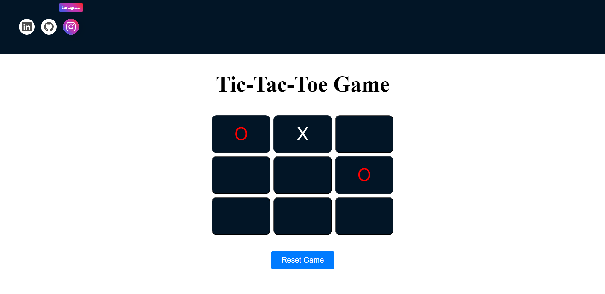

# TIC-TAC-TOE GAME
 Welcome to my Tic Tac Toe game! This project is a simple yet engaging implementation of the classic Tic Tac Toe game, developed using HTML, CSS, and JavaScript.
[Play the Game](https://tic-tac-toe-game-xi-weld.vercel.app/)
 
#Languages:

 
   
   
  

# Features
1. Interactive Gameplay: Play against a friend in a two-player mode.
2. Responsive Design: Enjoy a seamless experience on both desktop and mobile devices.
3. Clean and Simple UI: An intuitive interface that is easy to navigate.
4. Game Logic in JavaScript: Efficient and clean code handling game logic, ensuring a smooth experience.
# How to Play
1. Open the game in your web browser.
2. Player X starts the game by clicking on an empty cell in the 3x3 grid.
3. Player O takes their turn by clicking on an empty cell.
4. Players alternate turns until one player gets three of their marks in a row (horizontally, vertically, or diagonally) or the grid is full with no winner (a tie).

